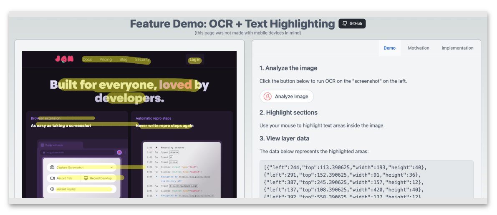

# Jam OCR and Highlighting feature demo

An interactive demonstration of what I can put together in a short amount of time, in hopes of aweing the team at Jam into hiring me 😌



See it live at [jam-demo.up.railway.app](https://jam-demo.up.railway.app/)! 🚀

## How it works

1. An expected "screenshot" is automatically loaded onto the left pane of the screen.
2. The user clicks "Analyze Image" which runs OCR on the image thanks to the [Tesseract.js](https://tesseract.projectnaptha.com/) library.
3. The OCR results are stored in a data layer, and a `canvas` element is created as an overlay on the image.
4. The user can use their mouse to "highlight" text on the image, which will only be highlighted in areas that match the OCR results.

## Install & Run

```bash
git clone https://github.com/felipemullen/jam-feature-demo.git
bun install
bun run dev
```

## Contact

If you find this project interesting or have any questions, feel free to reach out to me!
You can find my personal website at [felipemullen.com](https://felipemullen.com), which includes my [resume](https://felipemullen.com/resume), or check out my main GitHub profile at [github.com/felipemullen](https://github.com/felipemullen), which has more links.
